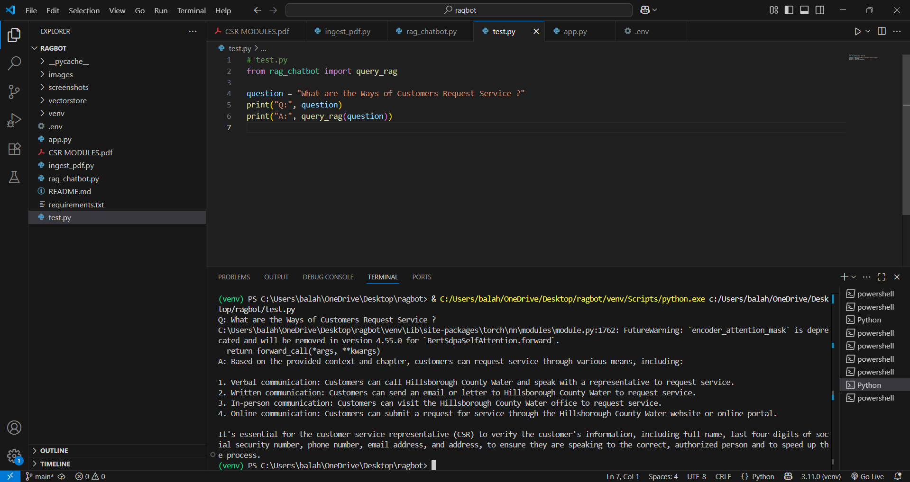
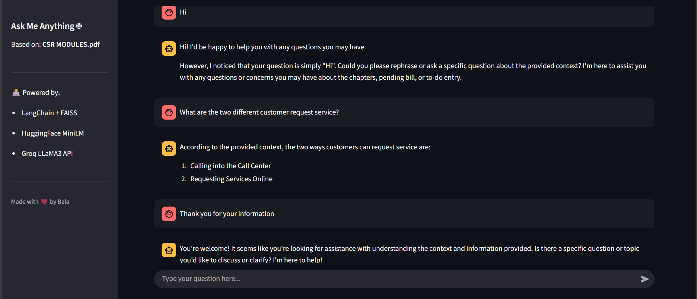

<!-- Core Technologies -->

<!-- LLM & Embeddings -->

<!-- Project Type -->

<!-- Dev & Infra -->

<!-- Meta Info -->

# RAG-Based Chatbot for Smart Customer Support Documents

This project implements a **Retrieval-Augmented Generation (RAG)** based chatbot to intelligently answer questions using a PDF document containing both **text and images**. It uses local embedding models and the **Groq API** for high-performance, cost-free generation, avoiding any paid APIs.

## 💡 Features

- Extracts both text (using PyMuPDF) and image data from PDF using OCR (Tesseract).
- Converts PDF into vector embeddings using `all-MiniLM-L6-v2`.
- Stores the embeddings in a FAISS vector database.
- Uses the **Groq API (LLaMA3)** for generating context-based answers.
- Runs locally in **Visual Studio / VS Code** using Python virtual environment.
- Simple test script (`test.py`) to query the bot.
- Clean architecture for maintainability and extension.

---

## 📁 Project Structure

- `.gitignore` – Files/folders ignored by Git
- `app.py` – 🚀 Streamlit or UI interface
- `CSR MODULES.pdf` – 📄 Input PDF file (text + image content)
- `images/` – 🌅 Auto-extracted images from PDF for OCR
- `ingest_pdf.py` – ⚙️ PDF parser, OCR, and embedding logic
- `rag_chatbot.py` – 🤖 Core RAG chatbot pipeline
- `requirements.txt` – 📦 Python dependencies
- `test.py` – 🧪 CLI script to interact with the chatbot
- `vectorstore/` – 🧠 Local FAISS vector database
- `README.md` – 📘 You're reading it now!

---

## 🛠️ Setup Instructions

### 1. Clone the Repository

- git clone https://github.com/balahariharasudhan/RAG-Based-Chatbot-for-Smart-Customer-Support-Documents.git

- Change the directory to the cloned repo by using -> cd RAG-Based-Chatbot-for-Smart-Customer-Support-Documents

### 2. Create and activate a Virtual Environment (To work separately without disturbing the existing versions)

- python -m venv venv
 
- .\venv\Scripts\activate       # For Windows

### 3. Install Requirements

- pip install -r requirements.txt

### 4. Configure Environment Variables (For ensuring security)

- Create a .env file and store your Groq API (Free):

- It should be in the form of: GROQ_API_KEY=your_groq_api_key

### 5. 📄 Ingest PDF

- You can either use the built-in PDF or upload your personal company documents as a PDF and chat with the bot

- Run the following to process your PDF and store the vector embeddings: python ingest_pdf.py

After successful running, it will:

- Extracts text.

- Extracts images and runs OCR using Tesseract.

- Embeds content using Sentence Transformers.

- Stores embeddings in FAISS DB (vectorstore/).

### 6. 🤖 Query Your Chatbot

- Use the test.py script to ask questions by: python test.py

### 7. 🌐 Launch Streamlit UI

- After successful completion, make sure to run the UI by using: streamlit run app.py 

-------------------------------------------------------------------------

### Sample interaction:

Q: What are the key objectives of CSR?
A: [Answer from context]

### 💬 Model Used

1) Embeddings: all-MiniLM-L6-v2 from Sentence Transformers (free, local).

2) LLM: llama3-8b-8192 via Groq API (free and fast inference).

## 📸 Screenshots

### 🔹 Sample Query and Response in terminal

### 🔹 Streamlit UI 

------------------------------------------------------------------------

✅ Key Learnings

- Used LangChain (0.3.27) with new modular packages like:

-> langchain-community

-> langchain-core

-> langchain-huggingface

- Enabled FAISS with allow_dangerous_deserialization=True for local use.

- OCR setup using pytesseract + pdf2image + Tesseract executable path config.

- Dealt with deprecated imports and updated LangChain compatibility manually.

### 🧠 Future Scope

- Expand to real-time document search (external knowledge integration).

🙋‍♂️ Author

- Balahariharasudhan T

- GitHub: https://github.com/balahariharasudhan

📜 License

- This project is for educational and research purposes only.
